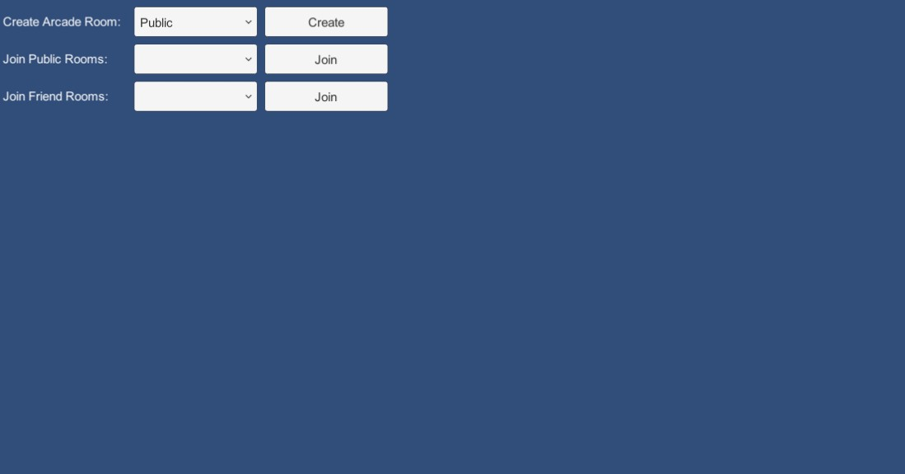
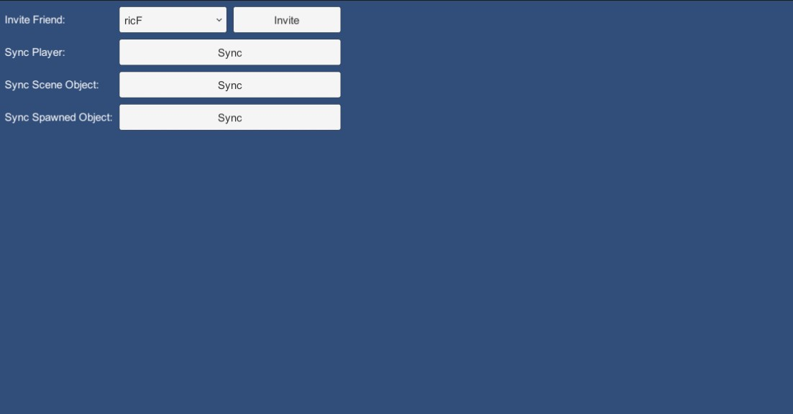

# MLAPI-Demo
A simple project that use MLAPI and its Steam transport with basic connection function and few RPC calls for demo purpose.

## Tested Environment
- Windows 10 19042.867 / macOS 11.2.3
- Unity 2019.4.18f1
- [MLAPI 0.1.0 preview](https://github.com/Unity-Technologies/com.unity.multiplayer.mlapi.git?path=/com.unity.multiplayer.mlapi#release/0.1.0)
- [SteamP2P Transport 1.0.0](https://github.com/Unity-Technologies/mlapi-community-contributions/tree/master/Transports/com.mlapi.contrib.transport.steamp2p)

## Prerequisites
- Make sure Steam is running on the background.
- Use another PC/Mac with another Steam account to test connection.

## UI
### Menu

In menu scrren, here you can:
- Host a room.
- Join a public room.
- Join a friend room.

### Host / Client

Show only after connected as host or client, here you can:
- Invite a friend to the room.
- Execute the RPC events on different objects.

## Prefabs
There are 3 prefabs for different demo purposes:
- *MultiplayerDemoPlayer*: The player prefab, each client has its own one.
- *MultiplayerDemoSceneObject*: An object spawned with the scene, MLAPI reference them using soft-sync, owned by host.
- *MultiplayerDemoSpawnedObject*: An object spawned after connection, owned by host.

## RPC Calls
Each prefab contains a RPC calls as:
- `OnSyncClick()`: Called on clicking the button, execute either `SyncServerRpc` or `SyncClientRpc`.
- `SyncServerRpc()`: Called from client to server only.
- `SyncClientRpc()`: Called from server to client only.

## Network Variable
Each prefab contains a `NetworkVariableInt` and change it every 30s. They can be checked on Editor inspector. This demostrate how MLAPI sync value automatically.

## Voice Chat
This demo use [Steam Voice](https://partner.steamgames.com/doc/features/voice) to detech and send voice, see (`MultiplayerDemoPlayer`)[Assets/Scripts/MultiplayerDemoPlayer.cs] for more details.